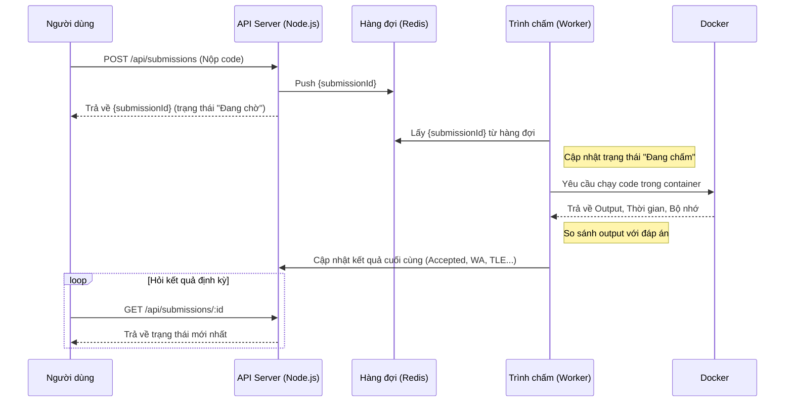

# DevLearn - Nền tảng Học và Luyện tập Lập trình Toàn diện

DevLearn là một hệ sinh thái học tập lập trình "tất cả trong một", được xây dựng để giải quyết khoảng trống giữa việc học lý thuyết và rèn luyện kỹ năng thực tế. Nền tảng kết hợp các bài giảng có cấu trúc với một hệ thống luyện tập và chấm bài tự động mạnh mẽ, mang lại trải nghiệm học tập liền mạch và hiệu quả.

## Mục tiêu dự án

- **Kết hợp Lý thuyết & Thực hành:** Tạo ra một vòng lặp học tập khép kín: Học lý thuyết trong các bài giảng -> Áp dụng ngay vào bài tập lập trình -> Nhận phản hồi tức thì từ hệ thống.
- **Phản hồi Tức thì & Chính xác:** Xây dựng một hệ thống chấm bài tự động, an toàn và có khả năng mở rộng để đánh giá code của người dùng với nhiều loại kết quả (Accepted, Wrong Answer, Time Limit Exceeded, ...).
- **Xây dựng Cộng đồng:** Thúc đẩy môi trường học tập tương tác thông qua các tính năng bình luận, thảo luận và bày tỏ cảm xúc.

## ✨ Tính năng nổi bật

- **📖 Học tập có cấu trúc:**
  - Quản trị viên có thể tạo các **Khóa học (Tutorials)** chứa nhiều **Bài học (Lessons)**.
  - Các bài học được sắp xếp theo thứ tự, đảm bảo lộ trình học tập logic.

- **💻 Luyện tập & Chấm bài tự động:**
  - Ngân hàng các **Bài toán (Problems)** đa dạng với nhiều độ khó.
  - **Hệ thống chấm bài bất đồng bộ:** API Server tiếp nhận bài nộp và đẩy vào hàng đợi (Redis), giúp hệ thống không bị tắc nghẽn.
  - **Môi trường thực thi an toàn:** Sử dụng **Docker** để chạy code của người dùng trong một container biệt lập, ngăn chặn mã độc và kiểm soát tài nguyên (thời gian, bộ nhớ).
  - **Hỗ trợ đa ngôn ngữ:** Hiện tại đã hỗ trợ C++ và Python.
  - Cung cấp phản hồi chi tiết về từng lần nộp bài.

- **👤 Quản lý người dùng & Xác thực:**
  - Đăng ký, Đăng nhập bằng Email/Password.
  - Xác thực qua các bên thứ ba: **Google & GitHub OAuth**.
  - Hệ thống xác thực an toàn sử dụng **JWT (Access Token & Refresh Token)**.
  - Chức năng "Quên mật khẩu" và đặt lại mật khẩu qua email.

- **💬 Tương tác cộng đồng:**
  - Tạo các bài viết, thảo luận chung.
  - Bình luận dưới các bài học, bài viết.
  - Bày tỏ cảm xúc (Like/Unlike) với nội dung.

## 🏗️ Kiến trúc Hệ thống Chấm bài

Đây là phần cốt lõi và phức tạp nhất của dự án. Hệ thống được thiết kế để đảm bảo tính ổn định, an toàn và khả năng mở rộng.

## 🚀 Công nghệ sử dụng

### Backend
- **Nền tảng:** Node.js, Express.js
- **Cơ sở dữ liệu:** MongoDB (với Mongoose ODM)
- **Xác thực:** JSON Web Tokens (JWT), Passport.js
- **Hàng đợi:** Redis
- **Môi trường thực thi code:** Docker
- **Ngôn ngữ:** JavaScript (ES6+)

### Frontend
- **Framework:** Flutter
- **HTTP Client:** Dio (với Interceptors để quản lý token)
- **Quản lý trạng thái:** Provider / BLoC
- **Lưu trữ an toàn:** `flutter_secure_storage`

